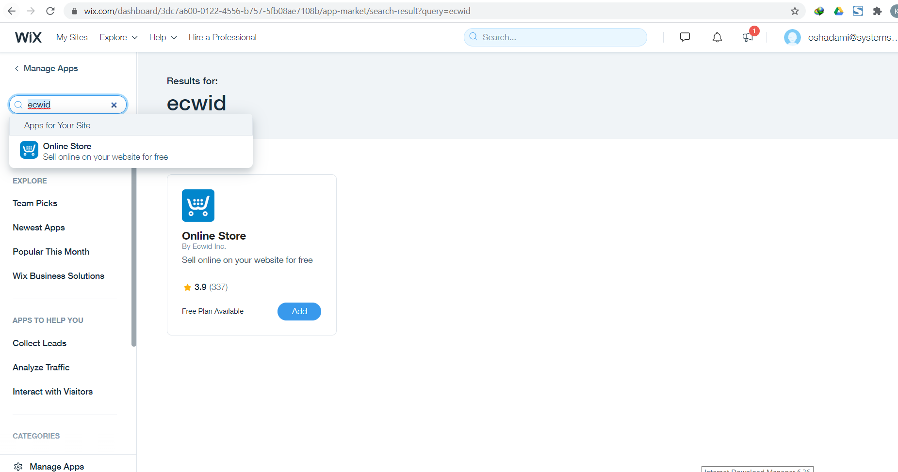
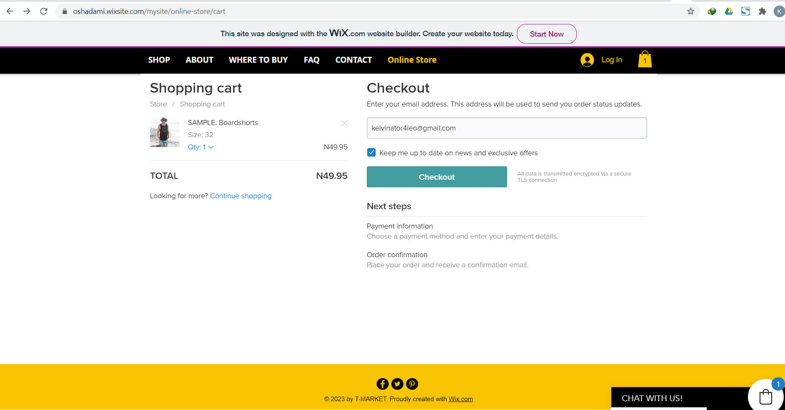

# Remita Payment Gateway Plugin For Wix
### How to setup Remita Payment Gateway on Wix Platform

---
- [Summary](#summary)
- [Plugin Features](#Plugin Features)
- [Installation instructions](#Installation instructions)
---
### Summary

With Remita Wix Payment Plugin, the store admin can easily add all desired payment methods to the Wix webshop. Please refer to https://www.remita.net for an overview of all features and services.

### Plugin Features

*   __Accept payment__ via Visa Cards, Mastercards, Verve Cards, USSDs, Mobile Money and eWallets.

* 	__Seamless integration__ into the Wix checkout page.

* 	__Secure payments__ with PCI-Compliance with fraud protection.

* 	__Automatic payouts__ to your bank account the next day.

---

### Installation instructions

Wix allows anyone to build a website from scratch without needing any design or website building experience. You can now use Remita to collect payments on your Wix store/site. To get started, follow the steps below:

1. Log in to your __Wix.com__ account or sign up for an account if you are a new user. Click on the __Settings__ tab, and then to __My Dashboard__ tab at the bottom of the scroll down menu.

2. Click on the __Apps__ tab on the left side of your Wix’s dashboard.

3. Next, select __App Market__ and search for __Ecwid__ on the __Search tab__ at the top right side of the web page.

4. Click on the __+Add App__ tab to add Ecwid to your Apps!

5. Once step 4 is completed also click on __+Add App__.

7. Next, click on the __Online Store__ tab on the left side of your dashboard to link your Ecwid site to your Wix site. Please click on the __I already have an Ecwid account__ button if you already have an Ecwid account or click on the __Create Account__ to create a new account. Check out our other tutorial on setting up __Remita on Ecwid__.

8. Next, click on __Connect__ to connect your Ecwid Store to your Wix site.

9. Next, click on __Accept__.

10. Click on _Site Actions_ dropdown and Select the __View Live Store__ option to visit your store.

11. On the created site, kindly click on the __Online store__ tab to access your store.

12. Now you can see your existing store on Ecwid placed on your Wix site, select the item(s) you wish to purchase.

13. Choose your preferred item size/quantity and click on the __Add to Bag__ button.

14. Input your email address and click on the __Checkout__ button.

15. Kindly choose __Remita Payment Gateway__ as your preferred __Payment Method__, fill in your other details and click on __Continue__.

16. Fill in your card details and pin.

Thank you for setting up Remita Payment Gateway on Wix following this simple steps.
